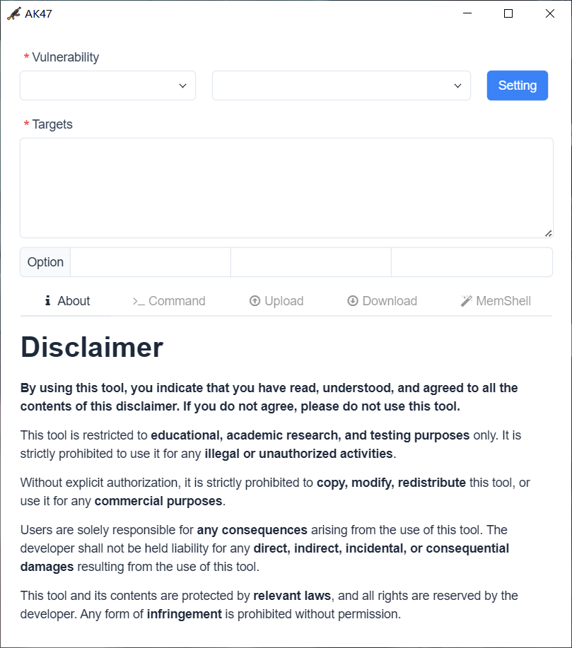
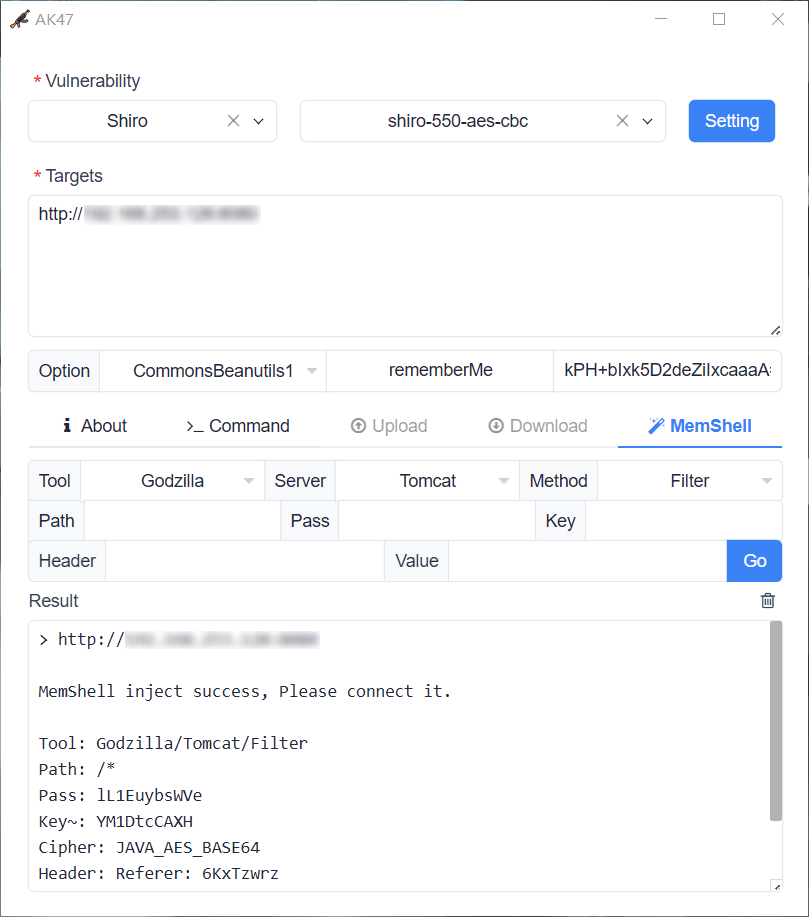

<h1 align="center">AK47</h1>

<div align="center">


</div>

<p align="center"> <a href="README.md">中文</a> | English </p>

> [!WARNING]
> This tool is strictly for security research and educational purposes. The user assumes all legal and related responsibilities arising from the use of this tool! The author assumes no legal or related responsibilities!

AK47 is a cross-platform vulnerability exploitation and security assessment tool. It features a built-in advanced engine and a variety of security extension modules, dedicated to significantly improving the efficiency of security validation.

## Features

- **Cross-Platform:** Windows / Linux / MacOS
- **Plugin-based:** Flexible rule orchestration and syntax engine
- **AI Support:** MCP deep linkage + Skill professional empowerment
- **Communication Protocols:** TCP / UDP / HTTP / WebSocket
- **External Extensions:** ysoserial / Java-Chains / MemShellParty
- **Agent Services:** OOB / JNDI / Service[DNS/LDAP/HTTP]

## Interface Preview

 

## FAQ

**1. How to start the MCP service?**

Start the MCP server via `./AK47 127.0.0.1:9999`, and check `AK47.log` to get the StreamableHTTP path.

**2. How to set up the Agent service?**

```bash
# AK47 configures the Agent and connects to https://xxx:6666/8418baac-ece1-4f1f-73ef-9bfc08eb886f
./rpg_linux_amd64 -l :6666
2026/01/01 12:00:00 config.go:93: using /8418baac-ece1-4f1f-73ef-9bfc08eb886f as agent endpoint
2026/01/01 12:00:00 service.go:360: starting dns server on :53
2026/01/01 12:00:00 service.go:217: starting tcp server on :6666
```

**3. Why can't it run on Mac?**

Please run the following command to remove the `com.apple.quarantine` attribute and try again:

```bash
sudo xattr -rd com.apple.quarantine /path/to/directory
```

**4. How to write an AK47 vulnerability plugin?**

Please read the [Wiki](skills/ak47-plugin-generator/references/SYNTAX.en.md) carefully, refer to the examples in the `plugin` directory, and then install the Skill via `npx skills add 99999G/AK47 --skill ak47-plugin-generator` to assist in writing.

**5. Why does a browser ad open every time the program exits?**

We are very sorry for the interruption. The ads will provide a little meager income for the author. Thank you for your understanding and support.

## Sponsorship

If this project is helpful to you, welcome to Star or sponsor to support us!

 

## References

- https://github.com/wailsapp/wails
- https://github.com/expr-lang/expr
- https://github.com/vulhub/java-chains
- https://github.com/pwntester/ysoserial.net
- https://github.com/ReaJason/MemShellParty
- https://github.com/woodpecker-framework/ysoserial-for-woodpecker
