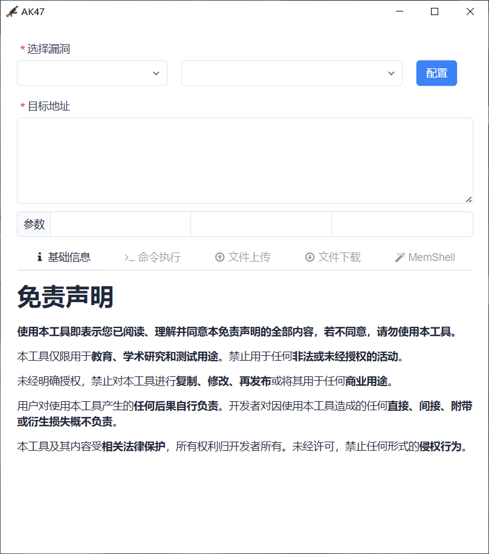
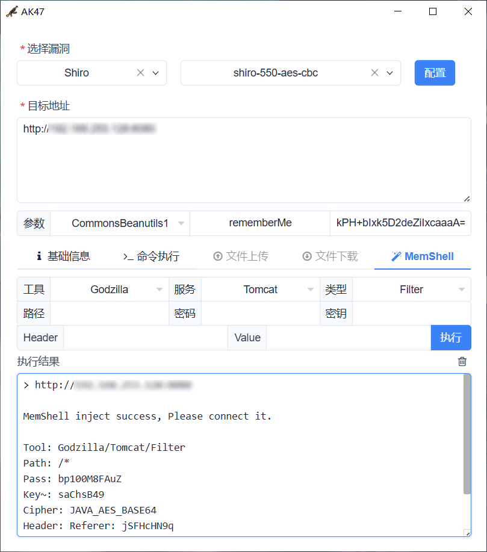

<h1 align="center">AK47</h1>

<div align="center">


</div>

<p align="center"> 中文 | <a href="README.en.md">English</a> </p>

> [!WARNING]
> 此工具仅限于安全研究和教学，用户承担因使用此工具而导致的所有法律和相关责任！ 作者不承担任何法律和相关责任！

AK47 是一款跨平台的漏洞利用与安全评估工具，内置高级引擎与多种安全扩展模块，致力于显著提升安全验证的工作效率。

## 功能特性

- **跨平台:** Windows / Linux / MacOS
- **插件化:** 灵活的规则编排与语法引擎
- **AI 支持:** MCP 深度联动 + Skill 专业赋能
- **通信协议:** TCP / UDP / HTTP / WebSocket
- **外部扩展:** ysoserial / Java-Chains / MemShellParty
- **Agent服务:** OOB / JNDI / Service[DNS/LDAP/HTTP]

## 界面预览

 

## 常见问题

**1. 如何启动 MCP 服务？**

通过 `./AK47 127.0.0.1:9999` 启动 MCP 服务端，查看 `AK47.log` 获取 StreamableHTTP 路径。

**2. 如何搭建 Agent 服务？**

```bash
# AK47 配置 Agent 并连接 https://xxx:6666/8418baac-ece1-4f1f-73ef-9bfc08eb886f
./rpg_linux_amd64 -l :6666
2026/01/01 12:00:00 config.go:93: using /8418baac-ece1-4f1f-73ef-9bfc08eb886f as agent endpoint
2026/01/01 12:00:00 service.go:360: starting dns server on :53
2026/01/01 12:00:00 service.go:217: starting tcp server on :6666
```

**3. 为什么 Mac 下无法运行？**

请执行以下命令移除 `com.apple.quarantine` 属性后重新运行：

```bash
sudo xattr -rd com.apple.quarantine /path/to/directory
```

**4. 如何编写 AK47 漏洞插件？**

请详细阅读 [Wiki](skills/ak47-plugin-generator/references/SYNTAX.zh.md)，并参考 `plugin` 目录下示例，然后通过 `npx skills add 99999G/AK47 --skill ak47-plugin-generator` 安装 Skill 来辅助编写。

**5. 为什么每次程序退出都会打开浏览器广告？**

非常抱歉打扰到您，广告将为作者增加一点微薄的收入，感谢您的理解与支持。

## 赞助支持

如果本项目对你有帮助，欢迎 Star 或赞助支持！

 

## 参考项目

- https://github.com/wailsapp/wails
- https://github.com/expr-lang/expr
- https://github.com/vulhub/java-chains
- https://github.com/pwntester/ysoserial.net
- https://github.com/ReaJason/MemShellParty
- https://github.com/woodpecker-framework/ysoserial-for-woodpecker
